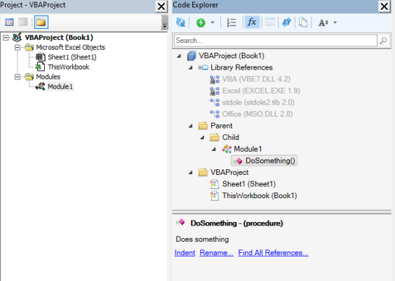
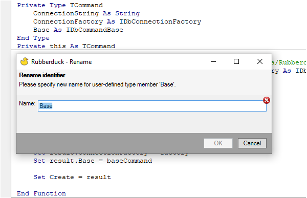
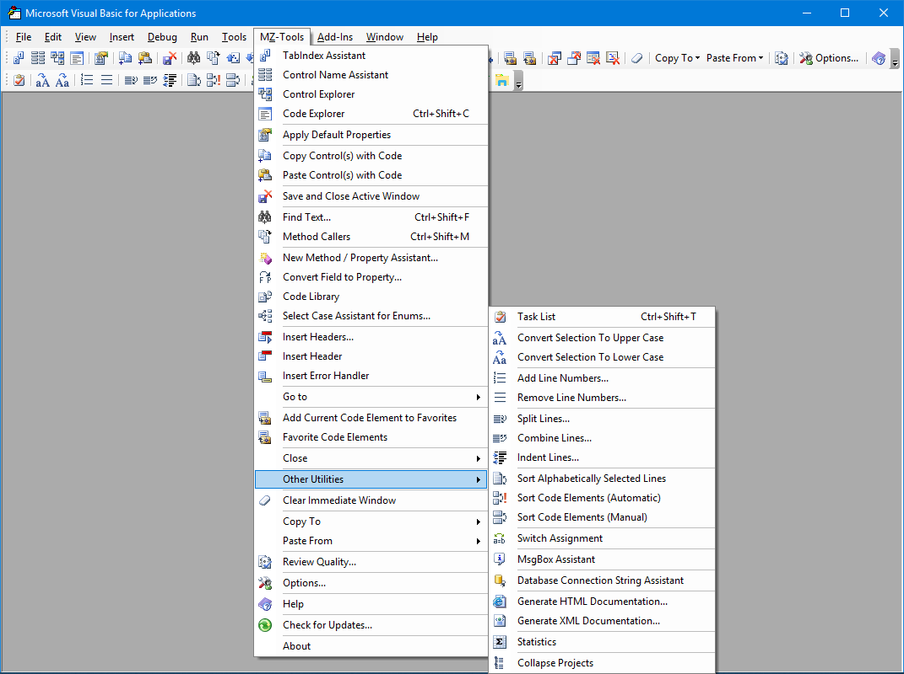
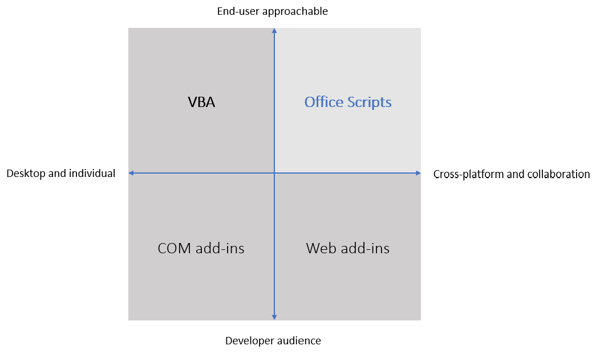

# Overview of Excel Development tools

```{note}
Author: Jeroen de Vries  
Date Posted: 15-feb-2023
```


When working with Excel at some point it becomes easier to do you work with additional tools. While most of the work that is done within excel can be done within a plethora of other applicaiton and programming languages it is actively used. Within Europe it has a market share of over 90% in the corporate and govermental enviroment. No wonder there are some many tools created around Microsofts Excel application. In this article I'll summarize all the tools around Excel for developers and users that invole some kind of programming. And I'll try to group them within distict catergories. 

I'll start listing the technologies as close to Excel as possible and expand outwards.

## Microsoft Excel
### Don't use additional tools 😉
Perhaps not the first item you would expect but I list this option here as I have fallen into the trap of thinking "Using technology x we can solve this problem easily" and similar thoughts along those lines. When working in a team, make sure the additional learning your colleagues have to do and investment have to make to learn the new tool along with your solution that's created within it. When using it for a one time project or your team agrees upon using other solutions a choise can be made of the technologies listed below. Otherwise you can learn about more advanced built-in functionality like turning tables or look for an existing formula like the [new Lambda function](https://support.microsoft.com/en-us/office/lambda-function-bd212d27-1cd1-4321-a34a-ccbf254b8b67) that perhaps already does what you do. 

## VBA - VisualBasic for Applications
Perhaps you are familiar twith the term Macro or VBA. VBA is a programming language that is provided within Excel. It can be used to automate nearly every interaction. Because it is delivered with Excel it does not require any setup or installation not for developers or for user.  of a workbook book with VBA code in it. Microsoft calls this a Macro enabled workbook. Excel files have the distinct .xlsm (m for macro) instead of the .xlsx extension. Within some strongly regulated corporate enviroments this VBA usage does not require a ticket through IT. Making it the first step towards automation. 
See the [VBA reference](https://learn.microsoft.com/en-us/office/vba/) for more information.

### Extending the VBA Editor
While VBA is still supported it's editor is dated from when VisualBasic 6 was released (from 1998)[^wiki_vb6]. That's where Rubberduck and MZ-Tools aim to support the developers with add-in. Because it is a tool only meant for developers and not attached to the workbook itself (but the code is) it means when you share the document to users. The underlying VBA code works and no additional configuration is needed. This is a huge benefit in my opinion. 


#### Rubberduck
 I have used [Rubberduck](https://rubberduckvba.com) extensively. Because of its many features like its Code Explorer making it easy to navigate through your classes and functions and the refactoring tool so you can easliy rename your variables or functions. Rubberduck is an open-source project. 




#### MZ-Tools
Within the similar domain is the add-in [MZ-tools](https://www.mztools.com). It provides also a sort of code explorer plus many more. MZ-Tools requires a paid license. 


## Microsoft Provided Platforms 
Besides VBA Microsoft provides some additional platforms as can be seen in this graph on the [Office Scripts Page](https://learn.microsoft.com/en-us/office/dev/scripts/resources/add-ins-differences).


### Office Scripts
[Office Scripts](https://learn.microsoft.com/en-us/office/dev/scripts/overview/excel) are not something for the regular home user as it requires a buisiness license. By using JavaScript or TypeScript you can make scripts similar to VBA. One big benefit is to be able to create workflows using PowerAutomate. A example is a workflow where a excel is routinely updated and sends a mail. Without needing user interaction. Another benefit is that because of the underlying JavaScript language and the way it is implemented the scripts are usable from the webversions as well. 

### COM-Addins 
Where Rubberduck and MZ-Tools are COM Add-ins (now developed using the VSTO - Visual Studio Tools for Office). You could create one yourself by using the .NET framework. A frequent used language is the .Net framework is C#. Learn how to create one [here](https://learn.microsoft.com/en-us/visualstudio/vsto/create-vsto-add-ins-for-office-by-using-visual-studio?view=vs-2022). As shown in the graph above, this is mainly meant for developers. In this case a VisualStudio License is needed in order to build the add-in, so a installer can be made to distribute it to the users. Desktop use only.

### Web add-ins 
Last one of the quadrant is the [Web add-ins](https://learn.microsoft.com/en-us/office/dev/add-ins/). It uses webtechnologies like HTML, CSS and Javascript. Microsoft depicts is as a embedded website within your office application. This Webapplication can then interact with the office application. One of the benefits is that is can run on mobile devices and in the case of a multiple end users provides options for a centralised deployment. 


## Expanding outwards
In the options summarized above we looked at only at the platforms provided by Microsoft itself or enhances the interactions within those platforms. Let's look a little bit further and list the possibilities to automate tasks using different platforms. 

## Programming Language specific tools and extensions
The selection for this paragraph is based on the idea that the user or the developer still opens en uses Excel to interact with the workbook. Otherwise I could list many more programming languages and platforms because interacting with Excel files is not the same as working with Excel as an application. 


### Python
### xlwings


[^wiki_vb6]: [Wikipedia on VisualBasic 6](https://en.wikipedia.org/wiki/Visual_Basic_(classic))


